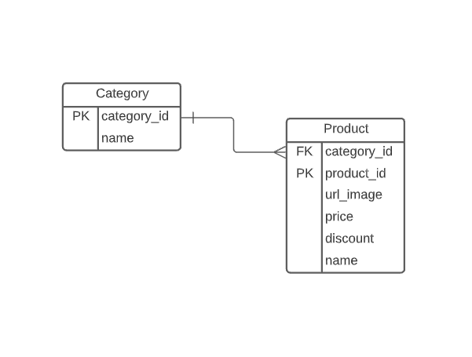

# Online Store - bsale

# Objectives

Build an online store that displays products grouped by category, generating separately backend (REST API) and frontend and using the database that is available to its development.

In addition, you have to add a search engine, which has to be implemented at the server, through an API Rest whose language and framework can be free choice.

The front-end must be developed with vanilla javascript without any framework, the use of libraries, components
specific, such as; bootstrap, material, Jquery, among others are allowed.

Finally, make the application and the repository available with the code and the hosting.

# Description of the Project

For the development of the project, the following tools were used:

- Ruby on Rails Api
- Active_model_serializers
- Heroku

## Database

- For this proyect there are 2 models. There's one assosiation Product belongs_to Category

  

### **Endpoints of API**

| Method | Endpoint   |      Functionality |
| ------ | ---------- | -----------------: |
| GET    | products   |   Get the products |
| GET    | categories | Get the categories |
| GET    | search     |     Get the search |

There are 3 current endpoints that are currently working.

For example in the local environment the BASEURL will be : http://localhost:3000/

- Get BASE_URL+products, the request to this end point will give a response with all the products in the database
- Get BASE_URL+categories, the request to this end point will give a response with all the categories from the product in the database.
- Get BASE_URL+search, the request is a string with all the different search arguments you need ( name, price, discount or any category from the menu)

## **API Deployed At:**

### [BSALE Online Store](https://bsale-online-store.herokuapp.com/)

## **Getting Started**

- Open your terminal and cd where you want to store the project.

`git clone https://github.com/Wusinho/booking-backend-api.git`

After that, open the folder with the code editor of your choice and follow the steps below.

## Setting up the necessary packages:

- Make sure you have [Yarn](https://yarnpkg.com/) installed in your machine.\*\*

- Open the terminal and go to the folder of the game and run the following commands:

  `yarn install`

  `bundle install`

- Those commands will ensure you installed the proper packages required and install all the gems needed for the project.\*\*

## Configure the Database

- You need to configure the database with the following commands:\

  - rails db:create
  - rails db:migrate
  - rails db:seed

- This command will create the database, migrate the tables as necessary, and populate it needed some data.

## Starting the Server

- To start the server run:  
  `rails s -p 4000`

**The front-end app is configured to run on 3000 port**

## **Author**

👤 **Heber Lazo**

- Github: [@Wusinho](https://github.com/Wusinho)
- LinkedIn: [Heber Lazo](https://www.linkedin.com/in/heber-lazo-benza-523266133/)

## 🤝 **Contributing**

Contributions, issues, and feature requests are welcome!

Feel free to check the [issues page](https://github.com/Wusinho/tienda-licor/issues).

## **Show your support**

Give a ⭐️ if you like this project!

## 📝 **License**

This project is [MIT](LICENSE) licensed.
